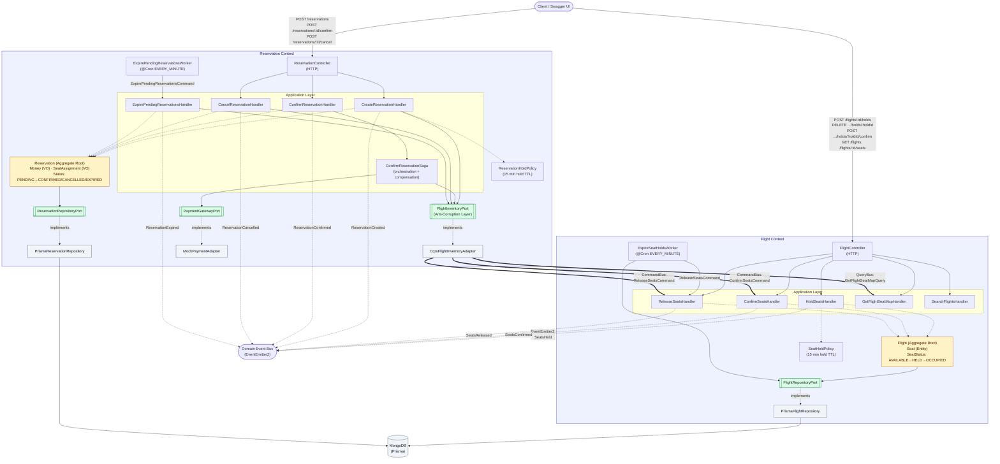
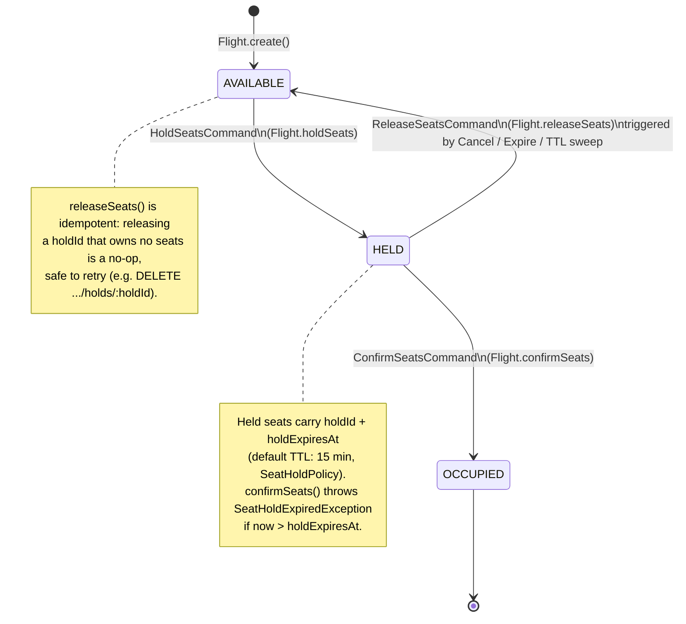
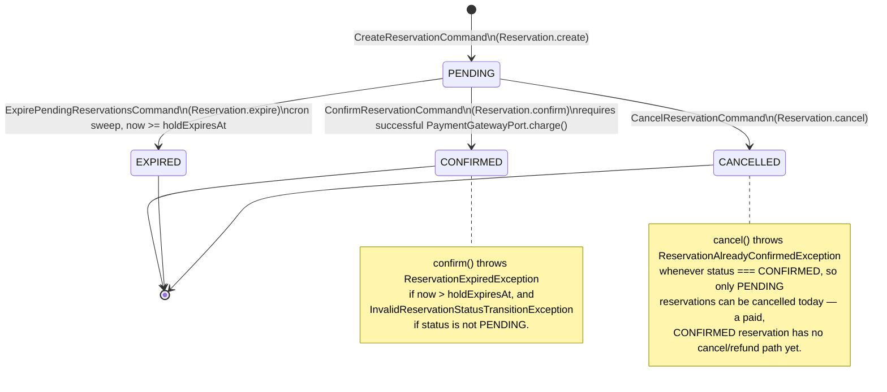

# Architecture Overview

This document describes the system architecture of the Airline Reservation
backend: a **modular monolith** built with NestJS, organized around two
strategic **Bounded Contexts** (Flight, Reservation) that communicate
in-process via `@nestjs/cqrs` and `@nestjs/event-emitter`.

- [1. System Architecture & Bounded Contexts](#1-system-architecture--bounded-contexts)
- [2. End-to-End Booking Sequence](#2-end-to-end-booking-sequence)
- [3. State Machines](#3-state-machines)
- [4. Architecture Narrative & Key Decisions](#4-architecture-narrative--key-decisions)

---

## 1. System Architecture & Bounded Contexts

The **Flight Context** owns flight schedules, seat inventory, pricing, and
temporary seat holds. The **Reservation Context** owns commercial bookings,
price snapshots, payment orchestration, and hold-expiration cleanup. Each
context follows a Hexagonal (Ports & Adapters) layout: HTTP controllers and
Prisma repositories are *inbound/outbound adapters* around a persistence-
ignorant application and domain core.

The Reservation context reaches the Flight context through a single
**Anti-Corruption Layer**, the `FlightInventoryPort`. Its only implementation,
`CqrsFlightInventoryAdapter`, is the one class in the Reservation module that
dispatches Flight commands/queries over the in-process `CommandBus` /
`QueryBus` and the one place that translates Flight's failure vocabulary
(`HoldNotFoundException`, `SeatHoldExpiredException`, …) into Reservation
terms. No Reservation handler imports a Flight command, query, or DTO, and
there are no direct repository or aggregate references across the boundary.
The multi-step confirm-and-pay flow is run by an explicit orchestration
**saga**, `ConfirmReservationSaga`, which owns forward steps and their
compensations.



**Legend**: solid arrows (`-->`) are direct dependencies within a layer;
double arrows (`==>`) are **cross-context CQRS calls**; dotted arrows
(`-.->`) are domain-event emissions or "implements port" relationships.

---

## 2. End-to-End Booking Sequence

The booking flow is a **2-step checkout**: hold seats, then create and
confirm a reservation against that hold. Everything the Reservation context
needs from the Flight context goes through the `FlightInventoryPort`
Anti-Corruption Layer: `CreateReservationHandler` re-prices every seat via
`FlightInventoryPort.getSeatPrices()` rather than trusting client-supplied
prices, and `ConfirmReservationSaga` charges payment before calling
`FlightInventoryPort.confirmSeats()` to flip the held seats to `OCCUPIED`.

```mermaid
sequenceDiagram
    autonumber
    actor Client
    participant FlightCtrl as FlightController
    participant HoldH as HoldSeatsHandler
    participant FlightAgg as Flight Aggregate
    participant ResCtrl as ReservationController
    participant CreateH as CreateReservationHandler
    participant FlightACL as FlightInventoryPort (ACL)
    participant SeatMapH as GetFlightSeatMapHandler
    participant ResAgg as Reservation Aggregate
    participant ConfirmH as ConfirmReservationHandler
    participant Saga as ConfirmReservationSaga
    participant Payment as PaymentGatewayPort
    participant ConfirmSeatsH as ConfirmSeatsHandler

    rect rgb(240, 248, 255)
    Note over Client, FlightAgg: Step 1 — Hold Seats
    Client->>FlightCtrl: POST /flights/:id/holds
    FlightCtrl->>HoldH: HoldSeatsCommand
    HoldH->>FlightAgg: holdSeats(seatNumbers, holdId, now)
    FlightAgg-->>HoldH: expiresAt (seats → HELD)
    HoldH-->>FlightCtrl: HoldSeatsResult { expiresAt }
    FlightCtrl-->>Client: 201 { holdId, expiresAt }
    end

    rect rgb(255, 250, 240)
    Note over Client, ResAgg: Step 2 — Create Reservation (PENDING)
    Client->>ResCtrl: POST /reservations { flightId, holdId, seatAssignments }
    ResCtrl->>CreateH: CreateReservationCommand
    CreateH->>FlightACL: getSeatPrices(flightId, seatNumbers)
    FlightACL->>SeatMapH: QueryBus: GetFlightSeatMapQuery(flightId)
    SeatMapH-->>FlightACL: FlightSeatMapDto
    FlightACL-->>CreateH: FlightSeatPrice[] (authoritative, minor units)
    CreateH->>ResAgg: Reservation.create(seatAssignments, prices, holdExpiresAt)
    ResAgg-->>CreateH: Reservation { status: PENDING }
    CreateH-->>ResCtrl: CreateReservationResult
    ResCtrl-->>Client: 201 { reservationId, status: PENDING, totalPrice }
    end

    rect rgb(240, 255, 244)
    Note over Client, ConfirmSeatsH: Step 3 — Confirm & Pay (ConfirmReservationSaga)
    Client->>ResCtrl: POST /reservations/:id/confirm { paymentMethodToken }
    ResCtrl->>ConfirmH: ConfirmReservationCommand
    ConfirmH->>Saga: run(reservation, paymentMethodToken)
    Saga->>Payment: charge({ amount, currency, paymentMethodToken })
    alt payment declined
        Payment-->>Saga: { success: false, failureReason }
        Saga-->>ConfirmH: throws PaymentFailedException (nothing captured, no compensation)
        ConfirmH-->>ResCtrl: propagates
        ResCtrl-->>Client: 4xx (reservation stays PENDING, no seats touched)
    else payment succeeds
        Payment-->>Saga: { success: true, paymentId }
        Note right of Saga: push compensation: refund(paymentId)
        Saga->>FlightACL: confirmSeats(flightId, holdId)
        FlightACL->>ConfirmSeatsH: CommandBus: ConfirmSeatsCommand
        ConfirmSeatsH->>FlightAgg: confirmSeats(holdId, now)
        alt hold expired / not found
            FlightAgg-->>ConfirmSeatsH: throws HoldNotFoundException / SeatHoldExpiredException
            ConfirmSeatsH-->>FlightACL: propagates error
            FlightACL-->>Saga: throws SeatConfirmationUnavailableException
            Saga->>Payment: refund({ paymentId, amount, currency, reason }) — compensation unwind
            Note over Saga,Payment: reservation is never persisted — stays PENDING in the DB.<br/>If the refund itself fails it is logged; manual reconciliation required.
            Saga-->>ConfirmH: throws SeatConfirmationFailedException { refunded }
            ConfirmH-->>ResCtrl: propagates
            ResCtrl-->>Client: 409 (reservation stays PENDING, refund attempted)
        else seats confirmed
            FlightAgg-->>ConfirmSeatsH: seats → OCCUPIED, SeatsConfirmed event
            ConfirmSeatsH-->>FlightACL: ConfirmSeatsResult
            FlightACL-->>Saga: ok
            Note right of Saga: push compensation: releaseSeats(holdId)
            Saga->>ResAgg: reservation.confirm(paymentId, now)
            Note right of Saga: if this throws, unwind: releaseSeats + refund
            Saga-->>ConfirmH: { paymentId }
            ConfirmH->>ResAgg: reservationRepository.save(reservation)
            Note right of ResAgg: Optimistic Concurrency Control:\nupdateMany({domainId, version}) must match 1 row
            ResAgg-->>ConfirmH: persisted, version incremented
            ConfirmH-->>ResCtrl: ConfirmReservationResult { status: CONFIRMED }
            ResCtrl-->>Client: 200 { reservationId, status: CONFIRMED, paymentId }
        end
    end
    end
```

### Compensating flows

| Trigger | Path | Effect |
|---|---|---|
| Client cancels a `PENDING`/unconfirmed reservation | `CancelReservationCommand` → `FlightInventoryPort.releaseSeats()` → `ReleaseSeatsCommand` | `Reservation` → `CANCELLED`; held seats → `AVAILABLE` |
| `ExpirePendingReservationsWorker` (cron, every minute) finds `PENDING` reservations past `holdExpiresAt` | `ExpirePendingReservationsCommand` → `FlightInventoryPort.releaseSeats()` per reservation | `Reservation` → `EXPIRED`; held seats → `AVAILABLE` |
| `ExpireSeatHoldsWorker` (cron, every minute) finds `Flight` documents with `HELD` seats past `holdExpiresAt` | `ReleaseSeatsCommand` per expired hold | Seats → `AVAILABLE`, independent of reservation state (covers holds that never became a reservation) |
| Seat confirmation fails after payment capture (e.g. hold expired), or the aggregate rejects `confirm()` after seats were confirmed | `ConfirmReservationSaga` unwinds its compensation stack: `releaseSeats()` (only if seats had been confirmed) then `refund()` | Reservation stays `PENDING` (never persisted as `CONFIRMED`); payment refunded if the refund succeeds. `SeatConfirmationFailedException` (409) is thrown either way, carrying a `refunded: boolean` flag — if the refund itself fails it is logged and manual reconciliation is still required |

---

## 3. State Machines

### 3.1 Flight Seat Status

Enforced inside the `Flight` aggregate (`flight.aggregate.ts`); seats are
entities embedded in the `Flight` document, keyed by seat number.



### 3.2 Reservation Status

Enforced inside the `Reservation` aggregate (`reservation.aggregate.ts`).



---

## 4. Architecture Narrative & Key Highlights

- **Strict Bounded Context boundaries with an Anti-Corruption Layer.**
  `Flight` and `Reservation` are separate NestJS modules, each with its own
  controllers, aggregates, repositories, and Prisma models. They never
  import each other's repositories or aggregates directly. The Reservation
  context talks to the Flight context through exactly one seam — the
  `FlightInventoryPort` ACL (`getSeatPrices` / `confirmSeats` /
  `releaseSeats`) — whose sole implementation, `CqrsFlightInventoryAdapter`,
  is the only Reservation-side class that imports a Flight command or query,
  dispatches over the `CommandBus` / `QueryBus`, and maps Flight exceptions
  (`HoldNotFoundException`, `SeatHoldExpiredException`, …) into a Reservation
  concept (`SeatConfirmationUnavailableException`). Handlers depend on the
  port, not the bus, so no Reservation handler knows a Flight type by name.
  `EventEmitter2` domain events are the other, fire-and-forget channel.

- **Reservation duplicates the hold-duration policy on purpose.**
  `ReservationHoldPolicy` mirrors `SeatHoldPolicy`'s 15-minute TTL rather
  than reading it from the Flight module, because `FlightSeatMapDto`
  deliberately does not expose raw hold-expiry internals across the
  context boundary. A small amount of duplicated business knowledge is
  accepted here in exchange for not leaking one context's internals into
  another's public contract.

- **Snapshotting immutable financial values (`Money` VO).**
  `CreateReservationHandler` resolves *authoritative* seat prices through
  `FlightInventoryPort.getSeatPrices()` — never trusting client-supplied
  amounts — and freezes them into `Money` value objects (integer minor
  units, e.g. cents) at reservation-creation time. The ACL is also the one
  place that knows the Flight context quotes whole currency units, doing the
  minor-units conversion so that leak never reaches a handler. Once captured in `SeatAssignment.price`,
  that snapshot is immutable and independent of any later change to the
  flight's catalog pricing, so a customer's confirmed price never drifts.

- **Optimistic Concurrency Control (OCC) on both aggregates.**
  Both `FlightModel` and `ReservationModel` carry a `version` field.
  `PrismaFlightRepository.save()` / `PrismaReservationRepository.save()`
  issue a conditional `updateMany({ where: { domainId, version } })`; if a
  concurrent writer already bumped the version, zero documents match and a
  `ConcurrencyConflictException` is thrown instead of silently clobbering
  the other writer's changes — critical for guarding against double-booking
  the same seat under concurrent hold/confirm requests.

- **Hexagonal Ports & Adapters decoupling.** Domain and application logic
  depend only on interfaces — `FlightRepositoryPort`,
  `ReservationRepositoryPort`, `PaymentGatewayPort`, `FlightInventoryPort` —
  injected via NestJS DI tokens (`FLIGHT_REPOSITORY_PORT`,
  `RESERVATION_REPOSITORY_PORT`, `PAYMENT_GATEWAY_PORT`,
  `FLIGHT_INVENTORY_PORT`). Concrete adapters (`PrismaFlightRepository`,
  `PrismaReservationRepository`, `MockPaymentAdapter`,
  `CqrsFlightInventoryAdapter`) are wired only in each module's `providers`,
  so persistence (MongoDB/Prisma), payment integrations, and even the
  cross-context transport can be swapped without touching a single aggregate
  or handler.

- **CQRS as the in-process integration bus.** Every write goes through a
  `Command` + `CommandHandler` pair and every cross-context read goes
  through a `Query` + `QueryHandler` pair via `@nestjs/cqrs`'s
  `CommandBus`/`QueryBus`. Cross-context calls are made only by
  `CqrsFlightInventoryAdapter` behind the `FlightInventoryPort` ACL, so the
  bus is an implementation detail of one adapter rather than something every
  handler reaches for. This still gives the modular monolith the same
  command/query vocabulary it would need if `Flight` and `Reservation` were
  ever split into separate services over the network — and swapping the
  adapter for an HTTP/gRPC client is then the only change on the Reservation
  side.

- **Domain events are fire-and-forget side channels, not the write path.**
  Aggregates queue events (`SeatsHeld`, `SeatsConfirmed`, `SeatsReleased`,
  `ReservationCreated`, `ReservationConfirmed`, `ReservationCancelled`,
  `ReservationExpired`) via `pullDomainEvents()`, and handlers emit them
  through `EventEmitter2` only *after* the aggregate has been persisted.
  State transitions themselves always happen synchronously inside the
  command handler (or saga) that owns them (e.g. `ConfirmReservationSaga`
  synchronously calls `FlightInventoryPort.confirmSeats()` rather than
  reacting to a `ReservationConfirmed` event) — this keeps the booking
  flow's critical path free of eventual-consistency races, while still
  giving downstream concerns (notifications, analytics, loyalty) a place to
  listen in.

- **Idempotent compensation for cleanup workers.** `Flight.releaseSeats()`
  is a no-op when the given `holdId` owns no seats, so both
  `ExpireSeatHoldsWorker` and the `FlightInventoryPort.releaseSeats()` calls
  from `CancelReservationHandler` / `ExpirePendingReservationsHandler` /
  `ConfirmReservationSaga` compensation can be retried safely after a crash
  or a duplicate cron tick without raising spurious errors. Both scheduled workers additionally guard against
  overlapping runs with an in-memory `isRunning` flag and continue past
  individual per-aggregate failures so one bad record can't stall an
  entire sweep.

- **`ConfirmReservationSaga` — explicit orchestration with a compensation
  stack.** The confirm-and-pay flow is a saga, not inline `try/catch`.
  `ConfirmReservationSaga.run()` executes forward steps in order —
  `PaymentGatewayPort.charge()`, then `FlightInventoryPort.confirmSeats()`,
  then `reservation.confirm()` — and pushes a compensating action after each
  side-effecting step (refund the payment; release the seats). Any failure
  from that point on unwinds the stack in LIFO order before the saga throws
  `SeatConfirmationFailedException` (HTTP 409 via `ReservationExceptionFilter`)
  carrying a `refunded: boolean` flag. Because the refund compensator is
  registered the moment the charge succeeds, a failure in *any* later step —
  including the aggregate rejecting `confirm()` — now reverses the payment,
  closing a gap the previous inline version had. A compensator that itself
  fails is logged and does not block the others. `ConfirmReservationHandler`
  keeps only load / persist / publish-events; it never touches payment or
  Flight directly.
  - **Known gap:** this is a *synchronous, best-effort* saga — saga progress
    is not persisted, so a process crash between steps is still unrecovered.
    Durable saga state (a `reservation_sagas` collection) plus a recovery
    worker were deliberately deferred.
